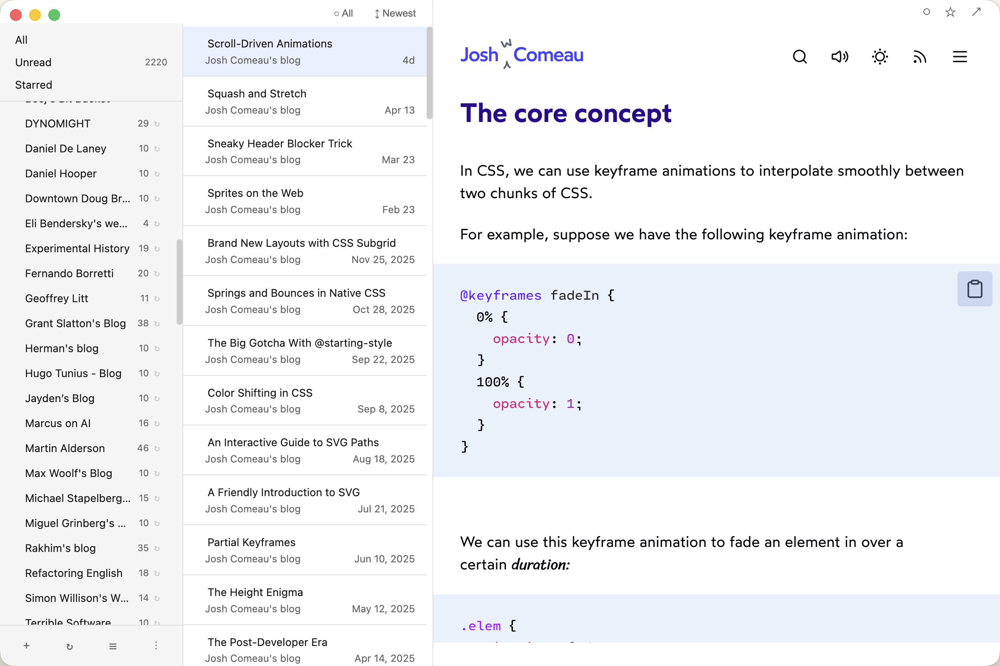

# Feedwell

A clean, native-feeling RSS reader for macOS that respects the original web.

**[中文文档](README.zh-CN.md)**



## Why Feedwell?

Most RSS readers strip articles into plain text, flattening every blog into the same uniform look. But many authors pour effort into their website design — custom typography, interactive demos, code playgrounds, and carefully crafted layouts. Feedwell takes a different approach: alongside traditional RSS article rendering, it can open the **original webpage** in a built-in webview, giving you the full experience the author intended.

This also means real pageviews for the blogs you follow — a small way to support the creators whose work you read every day.

## Features

- **Three-pane layout** — sidebar, article list, and reader in one window
- **Webview mode** — per-feed toggle to open original pages instead of extracted text
- **Smart folders** — All, Unread, and Starred filters
- **Folder organization** — group feeds with drag-and-drop
- **Per-feed refresh** — configurable intervals for each subscription
- **OPML import/export** — portable subscriptions
- **Stats dashboard** — monthly trends, feed health monitoring, anomaly detection
- **Keyboard shortcuts** — j/k navigation, mark read, star, refresh, and more
- **Dark mode** — follows your system preference
- **Virtual scrolling** — handles thousands of articles smoothly

## Tech Stack

- **Electron** + **React** + **TypeScript**
- **SQLite** via better-sqlite3
- **electron-vite** for fast development builds
- **react-virtuoso** for virtualized article lists

## Getting Started

### Prerequisites

- Node.js >= 18
- pnpm

### Install & Run

```bash
pnpm install
pnpm dev
```

### Build

```bash
pnpm package
```

Produces a universal DMG in `dist/`.

## License

MIT
